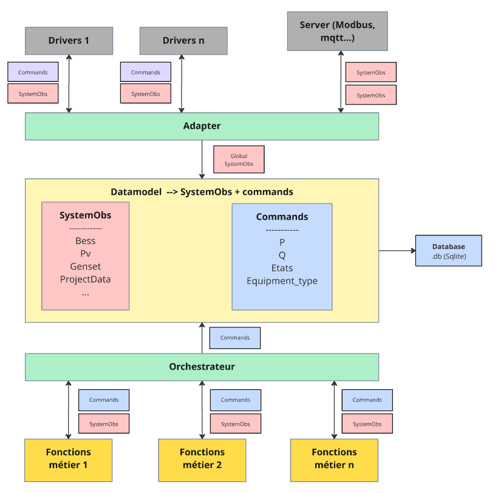

# EMS

Système de contrôle et de gestion pour centrales électriques hybrides, intégrant des équipements BESS (Battery Energy
Storage System) et PV (Photovoltaic). Le système collecte les données des équipements, applique des fonctions de
contrôle métier, et génère des commandes pour piloter les équipements.

/!\ ceci est une première ébauche. Fonctionnelle mais non finalisée (évidemment)

## Architecture

Le système suit une architecture en couches avec séparation claire des responsabilités :

- **Communication** : Interface avec les équipements physiques via des drivers (Modbus, etc.) et serveur Modbus pour
  exposer les données
- **Adapter** : Adaptation entre le monde externe (drivers, server) et le domaine applicatif
- **Application** : Orchestration du flux de données et gestion des threads
- **Core** : Orchestration des fonctions métier
- **Métier** : Fonctions de contrôle (voltage support, etc.) avec machines à états, politiques et lois de contrôle
- **Database** : Persistance des données agrégées

## Schéma des flux de données



### Description du flux

1. **Collecte des données** (Thread d'agrégation)

   - L'Adapter lit les données de tous les drivers (BessDriver, PvDriver)
   - L'Adapter lit également les données du serveur Modbus (setpoints, watchdog)
   - Chaque driver retourne un `SystemObs` avec ses données spécifiques
   - L'Adapter agrège tous les `SystemObs` en un seul `SystemObs` global
   - Le serveur Modbus expose les données agrégées (SOC, P, Q BESS) via des registres Modbus
   - Les données agrégées sont stockées dans une queue thread-safe
   - Les données sont sauvegardées dans la base de données SQLite

2. **Traitement métier** (Thread de traitement)

   - L'Application récupère le dernier `SystemObs` agrégé
   - L'Orchestrator exécute toutes les fonctions de contrôle (ControlFunction)
   - Chaque fonction métier génère une liste de `Command`
   - Les commandes sont stockées dans une queue thread-safe

3. **Envoi des commandes** (Thread d'agrégation)
   - L'Adapter récupère les commandes de la queue
   - Chaque commande est routée vers le driver approprié selon son `equipment_type`
   - Les drivers exécutent les commandes (écriture Modbus, etc.)

## Structure du projet

```text
ppc/
├── adapter/              # Adaptation entre drivers et domaine
│   └── adapter.py        # Lecture, agrégation, envoi de commandes
├── application/          # Couche d'orchestration
│   └── application.py    # Gestion des threads et coordination
├── communication/        # Interface avec les équipements
│   ├── interface.py      # Interface Driver (ABC) et Server
│   ├── driver/
│   │   ├── bess_driver.py    # Driver pour équipements BESS
│   │   └── pv_driver.py      # Driver pour équipements PV
│   └── server/
│       └── modbus_server.py  # Serveur Modbus pour exposer les données et recevoir des commandes
├── core/                 # Logique métier de coordination
│   └── orchestrator.py   # Orchestration des fonctions de contrôle
├── database/             # Persistance des données
│   └── database.py       # Interface SQLite pour SystemObs
├── datamodel/            # Modèles de données
│   ├── datamodel.py      # SystemObs, Command, EquipmentType
│   ├── interface.py      # Interface Protocol pour données avec timestamp
│   ├── standard_data.py  # Bess, Pv
│   └── project_data.py   # ProjectData
├── keys/                 # Constantes et clés
│   └── keys.py           # Clés pour ProjectData
├── metier/               # Fonctions de contrôle métier
│   ├── interface.py      # Interface ControlFunction
│   ├── utils/
│   │   └── watchog.py    # Watchdog pour surveiller la connexion des équipements
│   └── voltage_support/
│       ├── voltage_support.py  # Fonction de contrôle voltage support
│       ├── state_machine.py   # Machine à états (AUTO/ERROR)
│       ├── policy.py          # Politique de sélection des lois de contrôle
│       └── law.py             # Lois de contrôle (normal_law, error_law)
├── config/               # Configuration (à venir)
├── db/                   # Base de données SQLite (générée automatiquement)
│   └── YYYY_MM_DD.db     # Fichiers de base de données par jour
├── main.py               # Point d'entrée principal
└── README.md             # Documentation
```

## Installation

### Prérequis

- Python 3.10 ou supérieur
- pip

### Installation des dépendances

```bash
python3 -m venv venv
source venv/bin/activate
pip install pymodbus transitions
```

## Utilisation

### Lancement du système

```bash
python main.py
```

Le système démarre deux threads :

- Thread d'agrégation : collecte et agrégation des données toutes les secondes (par défaut)
- Thread de traitement : traitement métier et génération de commandes toutes les secondes (par défaut)

## Visualisation des données

Les données collectées et stockées dans les bases SQLite peuvent être visualisées en local avec Grafana.

### Lancement de Grafana

Un docker compose est configuré dans le dossier `grafana/` pour lancer Grafana avec accès aux bases de données SQLite :

```bash
cd grafana
docker-compose up -d
```

Grafana sera accessible à l'adresse : <http://localhost:3000>

Les dashboards et datasources sont automatiquement provisionnés au démarrage. Consultez le
[README du dossier grafana](grafana/README.md) pour plus de détails sur la configuration et l'utilisation.
